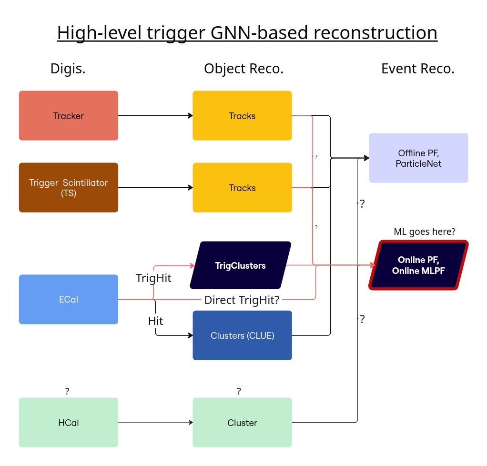

# mpetren-msceng-ldmx
This is a repo for the master thesis in Engineering Physics (MScEng) of Eliot M. Petrén, done for the Light Dark Matter eXperiment (LDMX) group of the Nuclear-and Particle Physics division of Lund University. 

**Please note that this project is ongoing**

## Working title: **Graph Neural Network-Based High-Level-Trigger Multi-Detector-Reconstruction in LDMX under Pile-Up​ Conditions**
### Translation: "Put the readouts of the whole detector in a graph and let a learning computer infer what the hell happened when there were several electrons at the same time"

## Overview

### Model flowchart illustration

### Reqiurements

This is a large repo containing everything that I have worked with so there are different requirements depening on where you look but here is a list of everything that is relevant. 

`Docker` - This repo utilizes the `ldmx-sw` framework and their corresponding Docker, find tutorial there. 

`Python 3.10` - Even though the Docker has Python I have utilized a Python installation outside of the Docker image, because it is easier to control and to install various ML-related packages to. 

`requirements.txt` - Install relevant packages from here that are dependencies for your Python installation (presumably outside of the Docker image). Use this command: `python3 -m pip install -r requirements.txt` 

### Branches
`main` - this is the front-page branch where I put milestone images of my repo (i.e most stable)

`eliot` - this is where I do my work and the latest stuff should be found here (i.e less stable)

`old_code` - this my showcasing bad practice of handling branches (don't be like me)

### Directories

`runs` - Configuration scripts from `ldmx-sw` that utilizes the simulation framework, the output from the scripts and python scripts that visualizes `.root`-files are all collected here. 

`gnn_playground` - Toy-model of the project for my own visualisation and a space where I teach myself things that will make a better project

`papers` - A collection of papers I find relevant for this project (though not an extensive list of all interesting papers)

`veckomote` - Meeting protocols and notes (in Markdown) from weekly meetings with my supervisor and other diploma students at LDMX at Lund University

## LaTeX pdfs related to this project (Overleaf)
* Master Thesis Project Plan: https://sv.overleaf.com/project/691b12336cc62effee4980ac
* Master Thesis Project Report: https://sv.overleaf.com/project/691c746f2f67d8225653d5af